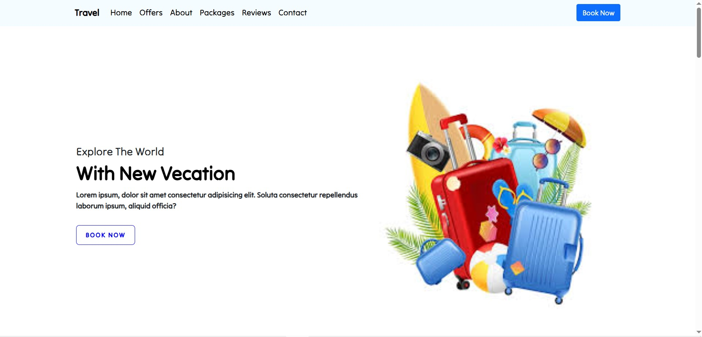

# 🌍 Travel Website  

- This project is simple and beautiful design website

---

## 🛠 Technologies Used

- **HTML** - Structure of the web page
- **CSS** - Styling for layout and design

---

## 📸 Preview



---

## 📂 Project Structure

```

|-- img
│   ├── About us
|   ├── Header
|   ├── Package Section
|   ├── Popular Section
|   ├── Reviews
│-- Travel.css
│-- Travel.html

```

---

## 🚀 Installation Guide

1. Clone the repository: 
```bash
   git clone https://github.com/AungPyaeSonOo/Travel-Website.git
```
2. Navigate into the project folder:   
```bash
   cd Travel-Website
```
---

## 🍴 How to Fork This Project

1. Click the **Fork** button on the top right of this repository.
2. Clone the forked repository:
```bash
   git clone https://github.com/AungPyaeSonOo/Travel-Website.git
```

3. Create a new branch for your changes:
```bash
   git checkout -b your-new-feature
```

4. Make your changes and commit them:
```bash
   git commit -m "Added your new feature"
```

5. Push the changes to your fork:
```bash
   git push origin your-new-feature
```

6. Create a **Pull Request**!

---

## 📬 Contact

If you have any questions or suggestions, feel free to reach out:
- **Email:** aungpyaesonoo002@gmail.com
- **GitHub:** [AungPyaeSonOo](https://github.com/AungPyaeSonOo)
- **LinkedIn:** [AungPyaeSonOo](https://www.linkedin.com/in/aung-pyae-son-oo-635761354)

---

⭐ If you like this project, give it a **star** on GitHub!
